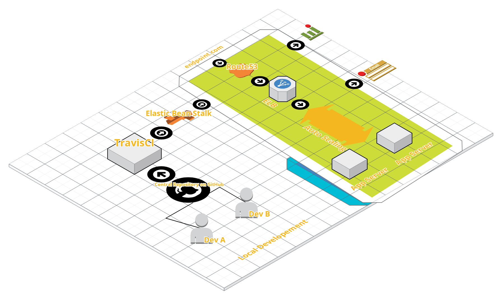

## Task 1

Below are the steps that'll use to automate integration and deployment of your current project.

### Steps:-
* I'll set up centralized remote repository on github or bitbucket.

* Add continuous integration tools such as CircleCi or TravisCi.

* AWS Elastic Bean stalk to care of rest of the infrastructure.

* Monitoring - CloudWatch and Newrelic(For Application monitoring)
 
### Working:-

* Every developer will push it's code to central remote repo.

* CI tool will run test on every commit and after it passes it, will send the build to elastic bean stalk api.
 
* EBS will provision rest of the infrastructure based on the parameters we set. Load balancing, autoscaling etc will be taken care by EBS
 
* CloudWatch will gather system level logs and NEwrelic will check application level logs.

### Diagram

