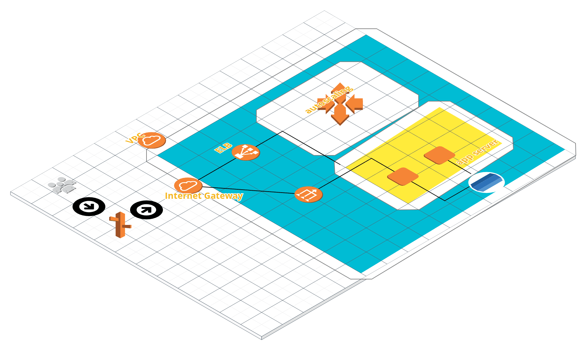
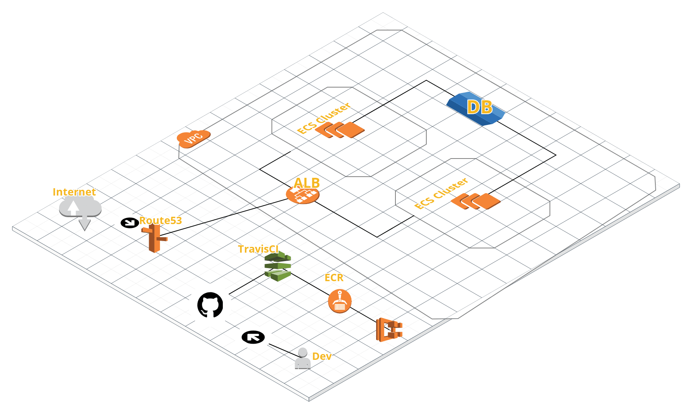

## Task2

### Current Stack:-

Currently, we use travisCi and elastic bean stalk for continuous integration and continuous deployment under VPC.

 
 
### Proposed Stack:-

If I completely own the architecture, then I'll follow the modern methodologies. I'll have microservice architecture, as it's more robust in terms of handling failures and distributing workloads within services
 
