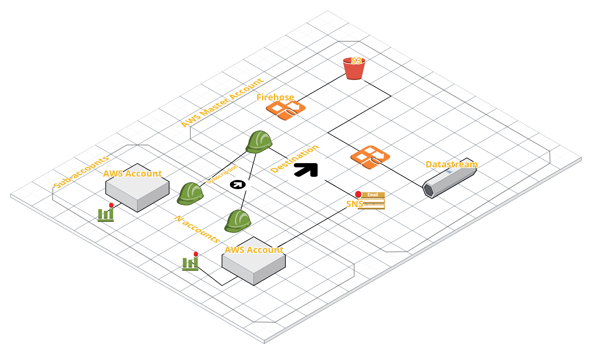

###Task3

For multiple account setup, I'll use aws organisation service with one master account and other service account, or can also define a hierarchy.
 
After this for monitoring, I'll setup central logging to master account using kinesis to s3 or ELK.

